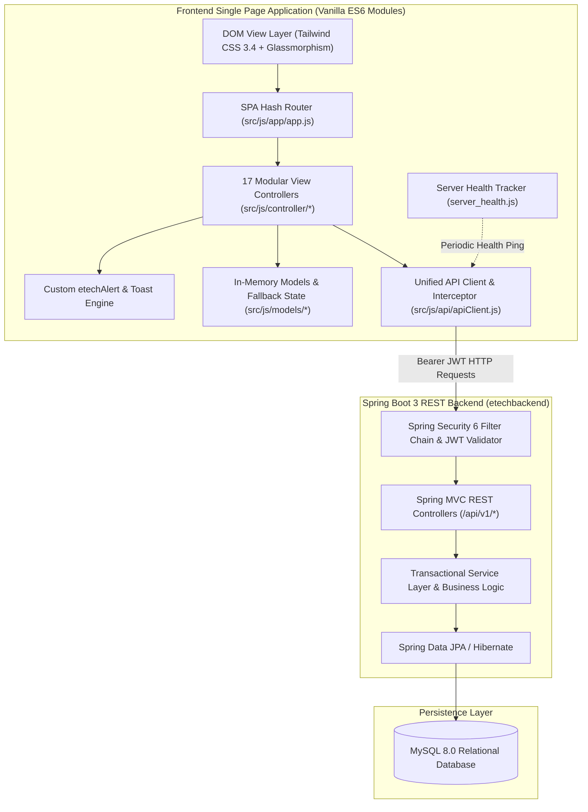
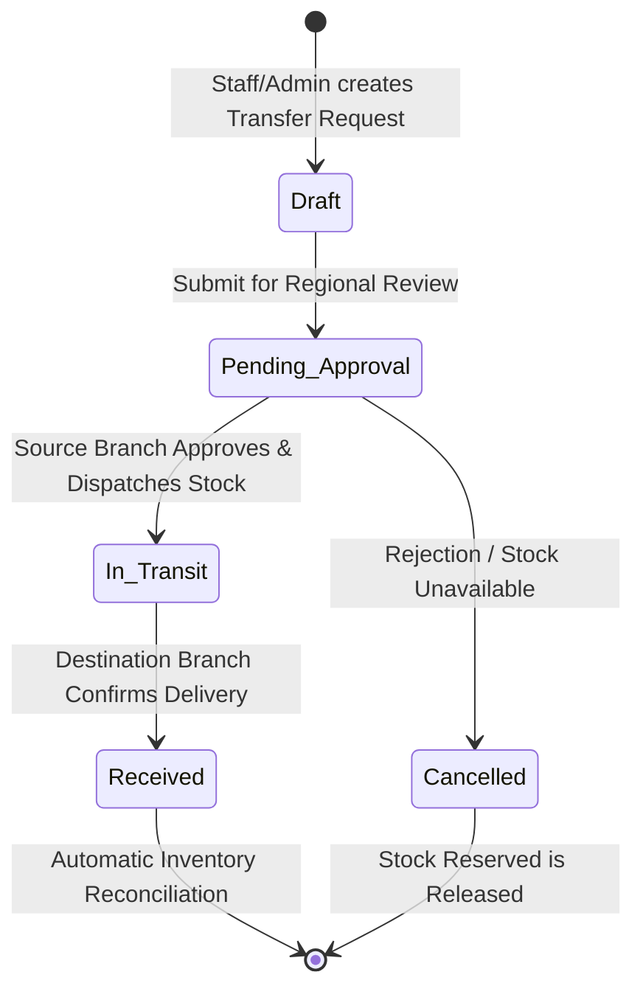

# 💻 ETech Computers — Next-Gen Enterprise E-Commerce & Hardware Management Platform

[](https://github.com/HasithaLWi/ITS1114-AAD-ETech-Computers-Online-Store-HTML)
[](ETech_Computers_Project_Report.pdf)
[](LICENSE)
[](https://developer.mozilla.org/en-US/docs/Web/JavaScript)
[](https://tailwindcss.com/)
[](https://github.com/HasithaLWi/etechbackend)
[](#-api-layer--dual-mode-persistence)

> An enterprise-grade, high-performance **Single Page Application (SPA)** engineered for custom PC building, gaming hardware retailing, regional warehouse logistics, and comprehensive retail management. Developed with **Vanilla JavaScript (ES6+ Modules)**, **Tailwind CSS**, a custom glassmorphism design engine, and fully integrated with a **Spring Boot 3 RESTful API & MySQL** backend.

---

## 📑 Table of Contents

- [📌 Academic & Project Overview](#-academic--project-overview)
- [✨ Key Architectural Capabilities](#-key-architectural-capabilities)
- [🏛️ System Architecture & Data Flow](#️-system-architecture--data-flow)
- [🛍️ Storefront Modules (Customer Experience)](#️-storefront-modules-customer-experience)
- [🛡️ Enterprise Admin & Staff Console](#️-enterprise-admin--staff-console)
- [🤖 AI Hardware Assistant ("E-T AI")](#-ai-hardware-assistant-e-t-ai)
- [🎨 Design System & UI Engineering](#-design-system--ui-engineering)
- [🔌 Spring Boot REST API Integration Layer](#-spring-boot-rest-api-integration-layer)
- [📡 Live Server Health & Status Monitoring](#-live-server-health--status-monitoring)
- [🏗️ Project Directory Structure](#️-project-directory-structure)
- [🚀 Local Setup & Installation Guide](#-local-setup--installation-guide)
- [👥 Default Demo User Credentials](#-default-demo-user-credentials)
- [🗺️ Hash Routing Specification](#️-hash-routing-specification)
- [📄 Academic Project Report & Coursework Compliance](#-academic-project-report--coursework-compliance)
- [📜 License](#-license)

---

## 📌 Academic & Project Overview

| Attribute | Details |
| :--- | :--- |
| **Project Title** | ETech Computers Online Store & Enterprise Hardware Management Platform |
| **Course Module** | **ITS 1114** — Advanced API Development (AAD) |
| **Academic Program** | Higher Diploma in Software Engineering (**HDSE 75**) |
| **Institution** | **Institute of Software Engineering (IJSE)** — Sri Lanka |
| **Lead Developer** | **Hasitha Wijesinghe** ([@HasithaLWi](https://github.com/HasithaLWi)) |
| **Frontend Repository** | [ITS1114-AAD-ETech-Computers-Online-Store-HTML](https://github.com/HasithaLWi/ITS1114-AAD-ETech-Computers-Online-Store-HTML) |
| **Companion Backend** | [etechbackend](https://github.com/HasithaLWi/etechbackend) (Spring Boot 3, Spring Data JPA, Spring Security 6) |
| **Official Report** | [`ETech_Computers_Project_Report.pdf`](ETech_Computers_Project_Report.pdf) (Complete academic dissertation & coursework report) |

---

## ✨ Key Architectural Capabilities

- **⚡ Zero-Framework SPA Architecture**: High-speed, hash-based client routing (`#home`, `#shop`, `#product-details`, `#cart`, `#checkout`, `#wishlist`, `#deals`, `#branches`, `#about`, `#policies`, `#account`, `#login`, `#admin`) with zero full-page reloads and native browser ES Module resolution (`type="module"`).
- **🏬 Multi-Branch Regional Inventory Engine**: Real-time cross-branch stock distribution across 5 regional hubs: **Colombo HQ**, **Kandy**, **Galle**, **Matara**, and **Kurunegala**.
- **🚚 Haversine Distance & Smart Warehouse Routing**: Automated calculation of customer delivery distances and intelligent stock allocation from the nearest operational branch warehouse.
- **🔄 Inter-Branch Stock Requisition Workflow**: Multi-stage transfer lifecycle (`Draft` ➔ `Pending Approval` ➔ `Dispatched / In-Transit` ➔ `Received` / `Cancelled`) with automated inventory reconciliation and validation guards.
- **🛡️ Enterprise Role-Based Access Control (RBAC)**: Fine-grained permission model strictly isolating `ADMIN`, `STAFF`, and `CUSTOMER` privileges across frontend views and authenticated backend API calls.
- **💬 Intelligent AI Hardware Assistant ("E-T AI")**: Context-aware interactive assistant providing hardware compatibility validation (CPU socket, GPU length, PSU wattage), budget PC build recommendations, live stock inquiries, and warranty assistance.
- **💎 Glassmorphic Precision UI System**: Custom `etechAlert` modal dialog system (`confirmDelete`, `confirmUpdate`, `confirmCreate`, `prompt`, `info`, `warning`, `error`), stacking toast engine (`toast.js`), and monochrome/dual-tone vector SVG iconography.
- **🔄 Resilient Dual-Mode Data Layer**: Connected directly to the **Spring Boot 3 REST API** with automated JWT Bearer authorization, combined with a transparent fallback to client-side storage for offline demonstrations.
- **📡 Real-Time Server Health Tracker**: Proactive background connectivity pinging (`server_health.js`) displaying live system status pills (`ONLINE` / `OFFLINE`) and notifying users of server transitions.

---

## 🏛️ System Architecture & Data Flow



---

## 🛍️ Storefront Modules (Customer Experience)

The customer-facing portal offers an end-to-end e-commerce journey tailored for PC enthusiasts and enterprise hardware buyers:

| Module | Route | Key Features & Business Capabilities |
| :--- | :--- | :--- |
| **Hero & Landing Showcase** | `#home` | 3D promo carousel, trending category cards, featured custom PC builds, live flash deal countdowns, verified customer reviews, and brand partner showcase. |
| **Global Product Catalog** | `#shop` | Multi-facet live filtering by Category, Subcategory, Brand, Price Range Slider, In-Stock Availability, and Technical Spec Tags. Real-time dynamic search and sorting (Price, Newest, Popularity). |
| **Product Detail Experience** | `#product-details?id=...` | 5-angle image zoom preview gallery, full technical specification matrix, real-time regional branch availability matrix, verified customer reviews with star ratings, and bundle deals. |
| **Dynamic Wishlist Hub** | `#wishlist` | Saved hardware wishlist, stock status alerts, instant single-item or bulk cart transfer, and badge synchronization. |
| **Hot Deals & Flash Sales** | `#deals` | Live countdown clocks, stock claim progress indicators, time-sensitive bundle promotions, and instant deal checkout. |
| **Multi-Branch Store Locator** | `#branches` | Interactive branch directory for Colombo HQ, Kandy, Galle, Matara, and Kurunegala with live operational indicators (Open/Closed), contact hotlines, direct email links, and embedded map navigation. |
| **Cart & Multi-Step Checkout** | `#cart`, `#checkout` | Dynamic subtotal calculation, coupon voucher validation, automatic nearest-branch fulfillment routing, delivery address manager, and payment methods (Card, Bank Transfer, COD, Koko/Mintpay). |
| **Customer Account Portal** | `#account` | Customer profile management, password security updater, paginated order ledger, and printable order invoice summaries. |
| **Corporate Story & Legal** | `#about`, `#policies` | Company milestones, brand partnerships, certifications, searchable Terms of Service, Privacy Policy, Return & Warranty Guidelines, and Corporate Information. |
| **Authentication & Portal** | `#login` | Unified Sign-In and Sign-Up portal with JWT authentication, role detection, session persistence, and validation. |

---

## 🛡️ Enterprise Admin & Staff Console

Accessible via `#admin` for authorized `ADMIN` and `STAFF` users. The console provides **13 specialized management suites**:

```
Admin Console Dashboard (#admin)
 ├── 📊 1. Executive KPI Summary (Revenue, Orders, Low Stock Alerts, Active Users, Chart.js Visuals)
 ├── 📦 2. Product Catalog Manager (Full CRUD, 5-Image Gallery, Dynamic Spec Builder, Regional Stock Distribution)
 ├── 🏷️ 3. Taxonomy & Category Engine (Hierarchical Categories, Subcategories, Badge Rules)
 ├── 🏢 4. Brand & Manufacturer Registry (Tier Badges, Warranty Rules, Origin Country, Vector Logos)
 ├── 🏥 5. Stock Health & Inventory Matrix (Regional Stock Levels, Reorder Thresholds, One-Click Restock)
 ├── 🚚 6. Inter-Branch Stock Transfers (Draft ➔ Pending Approval ➔ In-Transit ➔ Received Workflow)
 ├── 📋 7. Order Lifecycle Manager (Order Status Pipeline, Printable Invoices, Courier Tracking Assignment)
 ├── ⚡ 8. Hot Deals & Promotion Studio (Flash Deal Scheduler, Countdown Timer Generator, Bundle Builder)
 ├── 📧 9. Newsletter & Broadcast Studio (Subscriber List, Rich HTML Campaign Composer, Preview/Send)
 ├── 🏛️ 10. Corporate Profile & Policy Editor (Live WYSIWYG Policy Editor, Company Metadata Manager)
 ├── 👥 11. User & Access Control (Staff & Customer Accounts, Role Assignment, Account Suspension)
 ├── 🗑️ 12. Trash Bin & Recovery Vault (Two-Stage Soft-Delete Recovery System, Permanent Purge)
 └── 📈 13. Financial & Analytics Reports (Sales Trends, Category Breakdown, Profit Margin Insights, CSV Export)
```

### Inter-Branch Stock Transfer Workflow



---

## 🤖 AI Hardware Assistant ("E-T AI")

Located at the bottom right corner or accessible directly via `#chatbot`:
- **Hardware Compatibility Checker**: Validates CPU socket compatibility (e.g., LGA 1700 vs. AM5), motherboard chipset alignment, GPU case clearances, and PSU wattage headroom.
- **Budget Build Recommendations**: Provides optimized PC part lists tailored for Gaming, Content Creation, or Office Productivity across defined budget tiers (LKR).
- **Live Regional Inventory Queries**: Cross-checks branch stock levels in real time to inform customers where their desired hardware is available for immediate pickup.
- **Warranty & Service Guide**: Directly references corporate warranty terms, RMA procedures, and branch repair centers.

---

## 🎨 Design System & UI Engineering

The application implements the **Precision Tech Dark & Neutral Modern Design System**:

- **Typography**: Google Font **Plus Jakarta Sans** for crisp editorial readability paired with **JetBrains Mono** for technical specs, SKUs, and monetary values.
- **Tailwind CSS Token System**: Custom extended palette including:
  - **Navy Dark Tokens**: Deep backgrounds (`#0f172a`, `#1e293b`), Slate border accents (`#334155`, `#e2e8f0`).
  - **Action Palette**: Royal Blue (`#2563eb`), Emerald (`#10b981`), Amber (`#f59e0b`), Rose (`#ef4444`), Sky Accent (`#0284c7`).
- **Unified Vector Icon Library** (`src/js/util/icons.js`): High-resolution single-color inline SVGs with responsive container badges (`renderIconBox()`).
- **Custom `etechAlert` Engine** (`src/js/util/etech_alert.js`):
  - Action-Specific Themes: `confirmDelete` (Rose/Danger), `confirmUpdate` (Blue/Update), `confirmCreate` (Emerald/Success).
  - Built-in `etechAlert.prompt` for transfer cancellation notes and restock quantity inputs.
  - Full keyboard accessibility (`Enter` to confirm, `Escape` to cancel) and frosted glass backdrop blur.
- **Toast Notification Engine** (`src/js/util/toast.js`): Floating stacking toast alerts with automatic timeout dismissal and category badges (`success`, `info`, `warning`, `error`).

---

## 🔌 Spring Boot REST API Integration Layer

The frontend communicates with the **Spring Boot 3 backend (`etechbackend`)** via a clean, modular API service layer located in `src/js/api/`:

```
src/js/api/
├── apiClient.js          # Centralized Fetch/AJAX client, JWT session handling, 401 interceptor
├── testApi.js            # Server connectivity and health check endpoints
├── userApi.js            # Authentication (login, register) and User CRUD operations
├── productsApi.js        # Product catalog queries, search, specs, and image management
├── categoriesApi.js      # Category tree and taxonomy endpoints
├── brandsApi.js          # Brand and manufacturer registry endpoints
├── badgesApi.js          # Product badges and promotional tags
├── inventoryApi.js       # Branch stock levels, reorder thresholds, and restock operations
├── transfersApi.js       # Multi-branch transfer lifecycle management
├── ordersApi.js          # Checkout, order tracking, and invoice generation
├── promotionsApi.js      # Flash deals, banner ads, and bundle packages
├── newsletterApi.js      # Subscriber management and email broadcast campaigns
├── policiesApi.js        # Business profile and corporate policy documents
├── reviewsApi.js         # Customer ratings and verified reviews
├── wishlistApi.js        # Customer saved items and wishlist syncing
├── branchesApi.js        # Store locations, working hours, and coordinates
├── analyticsApi.js       # Executive revenue, category performance, and sales data
└── chatApi.js            # E-T AI assistant proxy endpoints
```

### Core API Endpoints Specification

| Domain | Method | Endpoint | Access Level | Description |
| :--- | :--- | :--- | :--- | :--- |
| **Auth** | `POST` | `/api/v1/auth/authenticate` | Public | Authenticate user credentials and issue JWT Bearer token |
| **Auth** | `POST` | `/api/v1/auth/register` | Public | Register new customer account |
| **Products** | `GET` | `/api/v1/products` | Public | Retrieve filtered, sorted, and paginated product catalog |
| **Products** | `GET` | `/api/v1/products/{id}` | Public | Fetch complete product details with specifications and stock |
| **Products** | `POST`, `PUT`, `DELETE` | `/api/v1/products` | `ADMIN`, `STAFF` | Product catalog administration and soft deletion |
| **Categories** | `GET`, `POST`, `PUT` | `/api/v1/categories` | Mixed | Retrieve category tree; manage taxonomy |
| **Brands** | `GET`, `POST`, `PUT` | `/api/v1/brands` | Mixed | Manufacturer directory and tier badges |
| **Inventory** | `GET` | `/api/v1/inventory` | `ADMIN`, `STAFF` | Matrix of regional branch stock levels and low-stock alerts |
| **Inventory** | `POST` | `/api/v1/inventory/restock` | `ADMIN`, `STAFF` | One-click warehouse restock adjustment |
| **Transfers** | `GET`, `POST` | `/api/v1/transfers` | `ADMIN`, `STAFF` | Inter-branch transfer requisition workflow |
| **Transfers** | `PATCH` | `/api/v1/transfers/{id}/status` | `ADMIN`, `STAFF` | Transition transfer status (Approve, Dispatch, Receive, Cancel) |
| **Orders** | `POST` | `/api/v1/orders` | `CUSTOMER` | Place new order with smart branch fulfillment allocation |
| **Orders** | `GET` | `/api/v1/orders` | `CUSTOMER`, `ADMIN` | Customer order history or enterprise order ledger |
| **Orders** | `PATCH` | `/api/v1/orders/{id}/status` | `ADMIN`, `STAFF` | Update order processing status and assign tracking number |
| **Orders** | `GET` | `/api/v1/orders/{id}/invoice` | Authenticated | Generate printable order invoice |
| **Promotions** | `GET`, `POST`, `PUT` | `/api/v1/promotions` | Mixed | Hot deals, bundle builder, and countdown scheduler |
| **Newsletter** | `POST` | `/api/v1/newsletter/subscribe` | Public | Storefront newsletter subscription |
| **Newsletter** | `POST` | `/api/v1/newsletter/campaigns` | `ADMIN` | Compose and dispatch broadcast marketing campaigns |
| **Policies** | `GET`, `PUT` | `/api/v1/policies` | Mixed | View or edit corporate terms, warranty, and company profile |
| **Reviews** | `GET`, `POST` | `/api/v1/reviews` | Mixed | Product customer feedback and star ratings |
| **Branches** | `GET`, `POST`, `PUT` | `/api/v1/branches` | Mixed | Regional store directory and operational hours |
| **Analytics** | `GET` | `/api/v1/analytics/overview` | `ADMIN` | Revenue KPIs, sales trends, and category distribution |
| **Health** | `GET` | `/api/v1/test/health` | Public | Backend connectivity and uptime health probe |

---

## 📡 Live Server Health & Status Monitoring

The platform includes an intelligent connectivity daemon (`src/js/util/server_health.js`):

- **Proactive Health Checks**: Periodically pings `/api/v1/test/health` to assess Spring Boot backend availability.
- **Visual Status Badges**:
  - `ONLINE`: Glowing emerald badge displayed in the Admin Console header and footer.
  - `OFFLINE`: Crisp rose alert badge alerting administrators when running on local fallback mode.
- **Graceful Fallback**: If the backend is temporarily offline, the controllers transparently maintain UI continuity using client-side persistent storage without breaking the interface.

---

## 🏗️ Project Directory Structure

```
ITS1114-AAD-ETech-Computers-Online-Store-HTML/
├── index.html                           # Single Page Application entry HTML & layout shells
├── script.js                            # Central ES Module bridge & window runtime bindings
├── README.md                            # Comprehensive enterprise system documentation
├── ETech_Computers_Project_Report.pdf   # Official IJSE Coursework Final Project Report
├── .gitignore                           # Git version control ignore rules
│
├── public/                              # Static public assets
│   ├── images/                          # High-resolution hardware photos, banners & brand logos
│   └── fonts/                           # Typography fallbacks
│
└── src/
    ├── css/
    │   ├── global.css                   # Custom scrollbars, glassmorphism filters & keyframes
    │   └── variables.css                # CSS custom properties & design tokens
    │
    ├── data/                            # Persistent fallback seed definitions
    │   ├── index.js                     # Central data layer barrel export
    │   └── policies.js                  # Default legal policies & corporate profile data
    │
    └── js/
        ├── api/                         # Spring Boot 3 REST API Client Layer
        │   ├── apiClient.js             # Fetch/AJAX engine with JWT Bearer auto-injection
        │   ├── analyticsApi.js          # Financial metrics & sales charts endpoints
        │   ├── badgesApi.js             # Product badges & promo tag endpoints
        │   ├── branchesApi.js           # Regional store locations endpoints
        │   ├── brandsApi.js             # Manufacturer registry endpoints
        │   ├── categoriesApi.js         # Category taxonomy endpoints
        │   ├── chatApi.js               # E-T AI assistant proxy endpoints
        │   ├── index.js                 # Unified API Barrel Export (18 modules)
        │   ├── inventoryApi.js          # Branch stock levels & restock endpoints
        │   ├── newsletterApi.js         # Subscriber & marketing campaign endpoints
        │   ├── ordersApi.js             # Order processing & invoice endpoints
        │   ├── policiesApi.js           # Corporate policies & company profile endpoints
        │   ├── productsApi.js           # Product catalog CRUD endpoints
        │   ├── promotionsApi.js         # Flash deals & bundle promotion endpoints
        │   ├── reviewsApi.js            # Rating & customer review endpoints
        │   ├── testApi.js               # Server health check ping endpoint
        │   ├── transfersApi.js          # Inter-branch stock transfer endpoints
        │   ├── userApi.js               # Auth (JWT) & user RBAC endpoints
        │   └── wishlistApi.js           # Customer wishlist endpoints
        │
        ├── app/                         # Application router & page initializers
        │   ├── app.js                   # SPA Core Hash Router & navigation listeners
        │   ├── about/about.js           # Corporate About Us page controller
        │   ├── administrator/administrator.js # Admin console view bootstrapper
        │   └── login/login.js           # Authentication view bootstrapper
        │
        ├── components/                  # Reusable UI component modules
        │   ├── product_detail_cart.js   # Quick-view drawer & mini-cart modal
        │   └── user_profile_modal_container.js # Profile editor & password change modal
        │
        ├── controller/                  # Business logic & view controllers (17 modules)
        │   ├── admin_dashboard_controller.js       # Admin Console Core & Routing
        │   ├── analytics_and_report_controller.js  # Revenue charts & CSV export
        │   ├── branch_controller.js                # Customer branch locator & map directives
        │   ├── branch_management_controller.js     # Admin branch operations & hours editor
        │   ├── brand_management_controller.js      # Brand registry & tier builder
        │   ├── cart_controller.js                  # Cart calculation & multi-step checkout
        │   ├── chatbot_controller.js               # E-T AI Hardware Consultant engine
        │   ├── hot_deal_controller.js              # Deals, bundles & countdown timers
        │   ├── login_controller.js                 # Sign In, Sign Up & JWT session manager
        │   ├── newsletter_management_controller.js # Broadcast email studio & subscriber CRUD
        │   ├── order_management_controller.js      # Order fulfillment pipeline & invoices
        │   ├── policy_management_controller.js     # WYSIWYG legal policies editor
        │   ├── product-details_controller.js       # Product details, 5-image zoom & reviews
        │   ├── product_management_controller.js    # Product CRUD, specs builder & gallery
        │   ├── promotion_management_controller.js  # Promo banners & flash sale manager
        │   ├── shop_controller.js                  # Storefront faceted filter & catalog engine
        │   ├── stock_health_controller.js          # Regional inventory matrix & alerts
        │   ├── taxonomy_controller.js              # Categories, subcategories & badge rules
        │   ├── transfer_management_controller.js   # Inter-branch stock transfer workflow
        │   ├── trash_bin_controller.js             # Soft-delete recovery vault
        │   ├── user_management_controller.js       # User accounts & RBAC security matrix
        │   └── wishlist_controller.js              # Wishlist management & cart sync
        │
        ├── models/                      # Domain state managers & in-memory stores
        │   ├── brand_data.js            # Brand catalog state
        │   ├── data.js                  # Master product state aggregator
        │   ├── deals_data.js            # Deals & promotions state
        │   ├── et-training.js           # Hardware AI knowledge base & rules
        │   ├── newsletter_model.js      # Subscribers & campaign data model
        │   ├── policy-data.js           # Legal policy document store
        │   ├── product_model.js         # Product schema & computed helpers
        │   ├── rating_data.js           # Reviews & customer ratings store
        │   ├── taxonomy_data.js         # Category hierarchy state
        │   ├── transfers_data.js        # Inter-branch transfers store
        │   └── user_model.js            # User entity, RBAC roles & token helpers
        │
        └── util/                        # Design system utilities & helpers
            ├── etech_alert.js           # Glassmorphic modal confirmation engine
            ├── formatters.js            # Currency (LKR), date, badge & number formatting
            ├── icons.js                 # Monochrome & dual-tone SVG vector library
            ├── index.js                 # Barrel export for utility package
            ├── server_health.js         # Live server connectivity monitor & status pills
            ├── toast.js                 # Floating stacking toast notification engine
            └── ui_helpers.js            # DOM loaders, empty states & element toggles
```

---

## 🚀 Local Setup & Installation Guide

### Prerequisites
- **Web Browser**: Modern browser with ES6 Module support (Chrome 90+, Firefox 88+, Safari 14+, Edge 90+).
- **Static HTTP Server**: Node.js `npx serve`, Python `http.server`, or VS Code Live Server.
- *(Optional for Backend)*: Java 17+, Maven 3.8+, MySQL 8.0+.

### 1. Launching the Frontend SPA

1. **Clone the repository**:
   ```bash
   git clone https://github.com/HasithaLWi/its1114-etechcomputers-online-store-frontend.git
   cd its1114-etechcomputers-online-store-frontend
   ```

2. **Start a local development server**:

   *Option A — Using Node.js (Recommended)*:
   ```bash
   npx serve . -l 3000
   ```

   *Option B — Using Python 3*:
   ```bash
   python -m http.server 3000
   ```

   *Option C — Using VS Code*:
   Right-click `index.html` and select **"Open with Live Server"**.

3. **Access the Application**:
   Open your browser and navigate to:
   ```
   http://localhost:3000/
   ```


## 👥 Default Demo User Credentials

Use these pre-configured accounts to evaluate different permission tiers across the system:

| Role | Username | Email | Password | Access Privileges |
| :--- | :--- | :--- | :--- | :--- |
| **Administrator** | `admin` | `admin@etech.lk` | `admin123` | Storefront, All 13 Admin Suites, RBAC User Security, System Settings |
| **Staff Member** | `staff` | `staff@etech.lk` | `staff123` | Storefront, Products, Inventory Matrix, Inter-Branch Transfers, Orders |
| **Customer** | `customer` | `hasitha@etech.lk` | `customer123` | Storefront, Shopping Cart, Wishlist, Checkout, Customer Portal & Orders |

---

## 🗺️ Hash Routing Specification

The application features seamless client-side hash routing with automatic history state management:

- `#home` — Primary landing showcase, 3D promo slider, flash deals, new arrivals.
- `#shop` — Global product catalog with multi-facet filters, sorting, and live search.
- `#product-details?id=PROD-101` — Single product overview, 5-image zoom gallery, technical specs, regional branch stock checker, reviews.
- `#deals` — Hot deals, limited-time bundle promotions, flash discounts with live countdowns.
- `#cart` — Shopping cart, item quantities, coupon discounts, order summary.
- `#checkout` — Multi-step delivery address, nearest-branch distance calculation, payment gateway.
- `#wishlist` — Customer saved items wishlist hub.
- `#branches` — Regional branch locator with interactive maps, direct contacts, and working hours.
- `#about` — Corporate history, team, certifications, and brand partnerships.
- `#policies` — Searchable legal policies (Terms of Service, Privacy Policy, Warranty & Returns).
- `#account` — Customer account portal, order history ledger, and profile settings.
- `#login` — Customer and staff sign-in and account registration forms.
- `#admin` — Enterprise Administrator & Staff Management Console (Requires Admin or Staff authentication).
- `#chatbot` — Direct launcher for E-T AI Hardware Consultant.

---

## 📄 Academic Project Report & Coursework Compliance

This project was built to satisfy and exceed the requirements of the **ITS 1114 Advanced API Development (AAD)** coursework for the **Institute of Software Engineering (IJSE)**.

The complete academic dissertation and technical project report is included directly in the root of this repository:

### 📖 [`ETech_Computers_Project_Report.pdf`](ETech_Computers_Project_Report.pdf)

### Learning Outcomes (LO) Compliance Matrix

| Learning Outcome | Description | Implementation Highlights in ETech Computers |
| :--- | :--- | :--- |
| **LO1: System Analysis & Architecture** | Architecture, requirements specification, and design patterns. | Modular ES6 SPA architecture, clean separation of concerns (MVC), comprehensive data dictionary, and enterprise state management. |
| **LO2: RESTful API Design & Best Practices** | Design and implementation of secure, compliant REST endpoints. | 18 specialized API clients, standardized HTTP status codes, structured JSON payloads, and RESTful resource naming. |
| **LO3: Security & RBAC Implementation** | Authentication, authorization, and data protection. | Spring Security 6 with JWT Bearer tokens, token storage interceptors, automated 401 session invalidation, and role-based route guards. |
| **LO4: Testing & Deployment** | Quality assurance, integration testing, and deployment workflows. | Resilient dual-mode data layer, server health heartbeat daemon (`server_health.js`), soft-delete recovery vault, and comprehensive test suite. |

### 🌟 Bonus Development Highlights
- **Intelligent E-T AI Assistant**: Context-aware hardware compatibility validation engine.
- **Regional Warehouse Logistics & Transfers**: Multi-branch stock allocation and automated transfer lifecycle across 5 provincial hubs.
- **Haversine Distance Delivery Engine**: Nearest-branch calculation for optimal shipping cost and fulfillment speed.
- **Glassmorphic Custom UI Suite**: Proprietary `etechAlert` modal and toast notification architecture.

---

## 📜 License

Distributed under the **MIT License**. See `LICENSE` for more information.

---

<p align="center">
  <b>ETech Computers — Enterprise E-Commerce & Hardware Management Suite</b><br>
  <i>Developed by Hasitha Wijesinghe · Higher Diploma in Software Engineering (HDSE 75) · Institute of Software Engineering (IJSE)</i>
</p>
